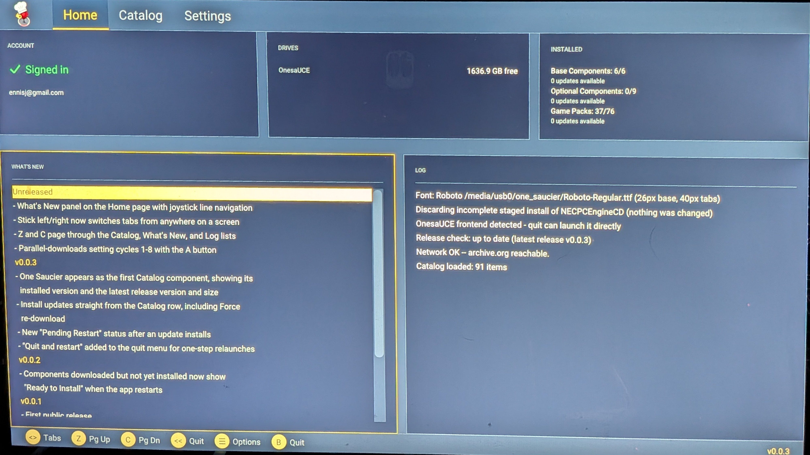
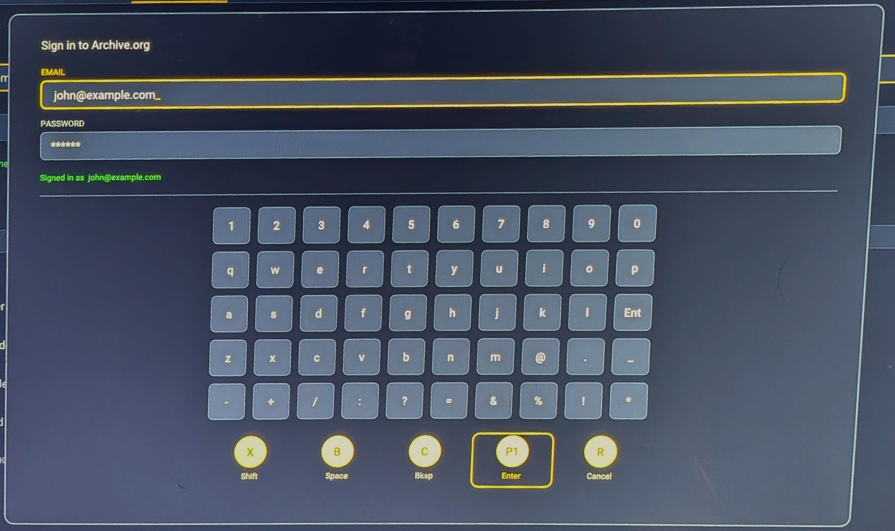
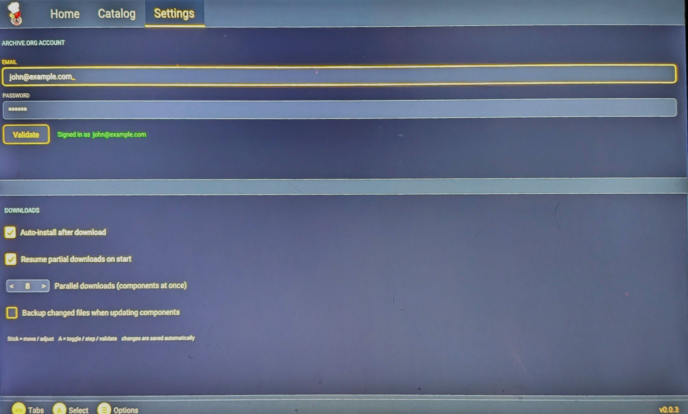
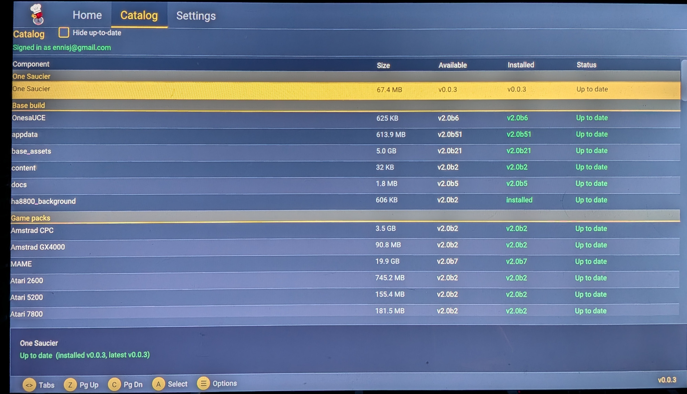
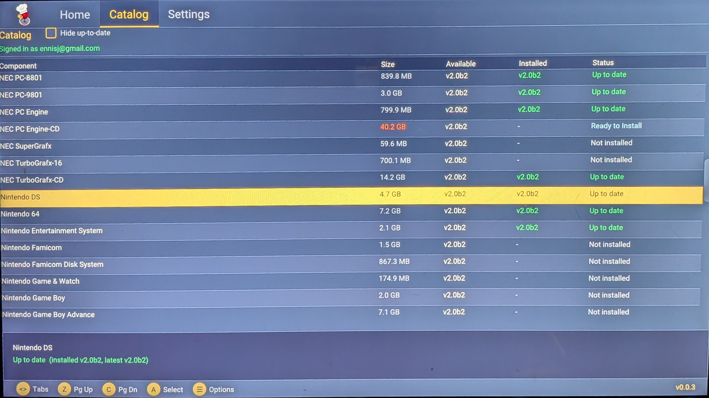

# One Saucier

  

**One Saucier** is a standalone, on-device downloader for the AtGames Legends
Ultimate (ALU). It runs directly on the cabinet and downloads / installs
OnesaUCE content from Archive.org onto the drive it's running from — no PC
required after setup.

  

## Features

- **Browse the full OnesaUCE catalog on the cabinet** — base build, 75+ game
  packs, videos, and themes, with live install status for every component
- **Parallel downloads** — up to 8 components at once, each with pause,
  resume, and cancel; interrupted downloads survive reboots and resume where
  they stopped
- **Crash-safe staged installs** — components are extracted to a staging area
  and moved into place only when complete, so a power cut can never leave a
  component half-updated
- **Version-aware** — sees what's installed, flags updates, skips components
  that are already current, and remembers downloads that are still waiting to
  install ("Ready to Install")
- **Archive.org sign-in on screen** — credentials entered once with the
  on-screen keyboard and remembered
- **Quit straight into the OnesaUCE frontend** — no round-trip through the
  ALU menu
- **Self-updating** — One Saucier appears in its own catalog as the first
  component and updates itself from this repository's releases
- **What's New on the Home page** — the release notes for every version,
  right on the cabinet

## Installation

1. Download `one_saucier_v<version>.zip` from the
   [latest release](https://github.com/ennisj/one_saucier/releases/latest).
2. Extract it to the **root of your OnesaUCE USB drive** so that
   `one_saucier.uce` and the `one_saucier/` folder sit side by side at the
   drive root.
3. Insert the drive, boot the ALU, and select **One Saucier** from the games
   menu (BYOG section).

An Archive.org account is required for downloads — create one at
[archive.org](https://archive.org/account/signup) and sign in from the app's
Settings screen.

## Signing in

Open **Settings**, select the email field, and enter your Archive.org
credentials with the on-screen keyboard. **Validate** checks them against
Archive.org and stores them on the drive — you stay signed in across
launches.

  

Settings also holds the download options: auto-install after download, resume
partials on start, how many components download in parallel, and optional
backups of files an update overwrites.

  

## Browsing and installing

The **Catalog** lists every component grouped by category, with its size, the
available version, your installed version, and a colour-coded status. One
Saucier itself is the first row — it updates like everything else.

  

Select a component with **A** and confirm to download and install it. Pick
several — they queue up and download in parallel while installs run one at a
time in the background. The status column tracks every state:

| Status | Meaning |
| --- | --- |
| **Up to date** | Installed and current |
| **Update Available** | Installed, but a newer version exists |
| **Not installed** | Available to download |
| **Downloading / Installing** | In flight right now |
| **Queued for Download** | Waiting for a parallel-download slot |
| **Paused** | Stopped by you; resumes where it left off |
| **Ready to Install** | Downloaded but not yet installed (kept across restarts) |
| **Pending Restart** | A One Saucier update is installed; restarts into the new version |

  

The **Menu** button opens contextual options wherever you are: install or
force re-download the selected component, pause / resume / cancel its
download, hide up-to-date rows, refresh the catalog, and quit.

## Updating One Saucier

The app checks this repository for a newer release at startup. When one
exists, the **One Saucier** catalog row shows *Update Available* (and the Home
page calls it out) — install it like any component. After it applies, the row
reads **Pending Restart**: choose *Menu → Quit → Quit and restart* and the new
version boots immediately. Your sign-in, settings, and download state are
always preserved.

## Controls

| Control | Action |
| --- | --- |
| Stick left / right | Switch tabs (on Home: What's New → Log → next tab) |
| Stick up / down | Move through lists, line by line |
| A | Select / confirm / toggle |
| Z / C | Page up / page down (Catalog, What's New, Log) |
| Menu | Contextual options |
| Rewind / B | Close dialog; quit (from Home) |

On the sign-in keyboard: **A** types the highlighted key, **P1** is Enter,
**X** shift, **B** space, **C** backspace, **Rewind** cancels.

## Good to know

- Downloads, staged installs, logs, and settings all live inside
  `one_saucier/.one_saucier/` on the drive — nothing is scattered at the
  drive root.
- If something goes wrong, `one_saucier/.one_saucier/activity.log` holds a
  timestamped record of every session — include it when reporting an issue.
- Very large packs are multi-hour downloads; you can pause them, quit, or
  power off — progress is kept and resumes on the next attempt.
