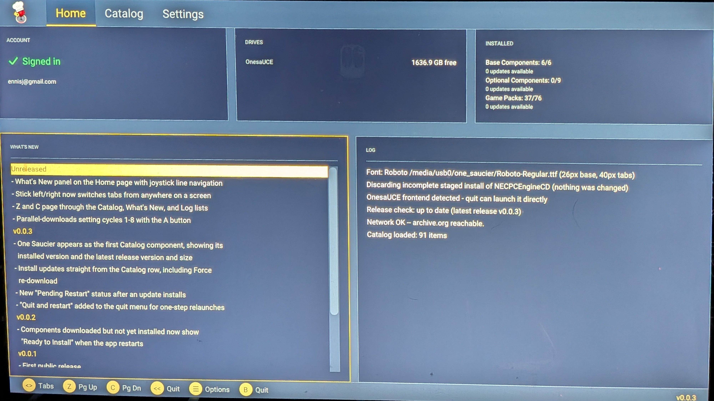
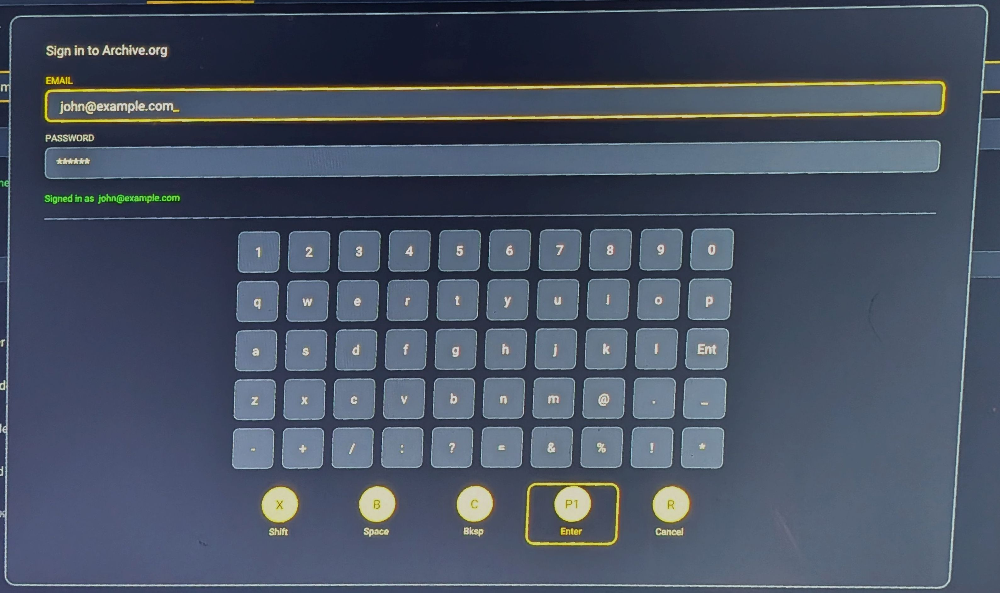
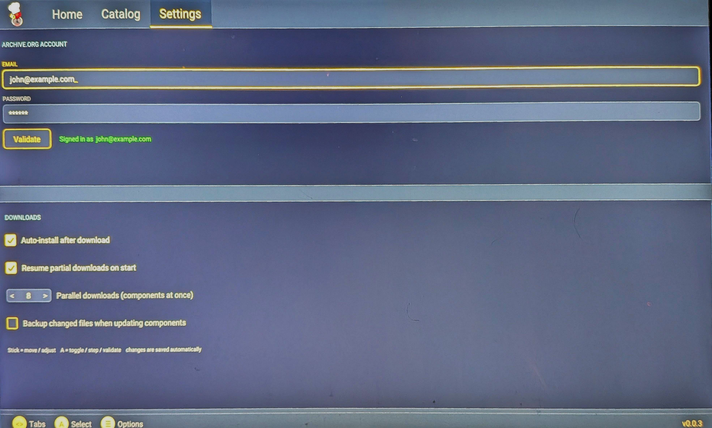
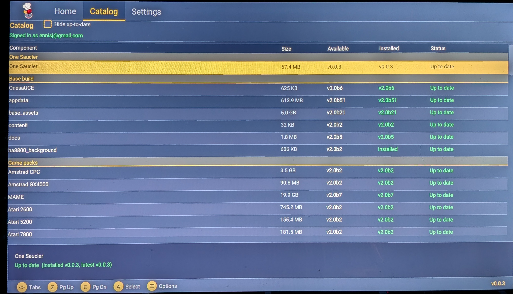
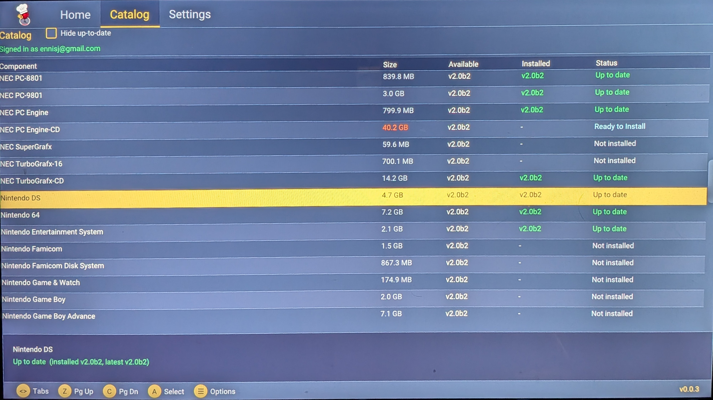

# One Saucier

<p align="center">
  
</p>

**One Saucier** is a downloader and library manager for **OnesaUCE** content
from Archive.org. It began as a standalone, on-device app for the AtGames
Legends Ultimate (ALU) — it runs directly on the cabinet and installs content
onto the drive it's running from, no PC required — and since v0.2.0 it also
ships as **Windows and macOS apps** that can manage a local library and pair
with your cabinet over your home network.

<p align="center">
  
</p>

## Features

**On the cabinet**

- **Browse the full OnesaUCE catalog** — base build, 75+ game packs, videos,
  and themes, with live install status for every component
- **Browse your installed library** — the BROWSE tab shows your games with
  their marquees, logos, story text, artwork, and videos, right on the cabinet
- **Parallel downloads** — up to 8 components at once, each with pause,
  resume, and cancel; interrupted downloads survive reboots and resume where
  they stopped
- **Crash-safe staged installs** — components are extracted to a staging area
  and moved into place only when complete, so a power cut can never leave a
  component half-updated
- **Version-aware** — sees what's installed, flags updates, skips components
  that are already current, and remembers downloads that are still waiting to
  install ("Ready to Install")
- **Uninstall** game packs, videos, and themes from the Catalog; files shared
  with other components are kept automatically
- **Sort and filter the Catalog** by any column and by status — and it keeps
  working offline, falling back to the last saved copy when Archive.org can't
  be reached
- **Two themes** — the standard horizontal layout, plus a **Vertical theme**
  for rotated monitors and pinball cabinets (Settings ▸ Theme)
- **Edit OnesaUCE's own options** from the Settings screen's OnesaUCE tile —
  pinball rotation fix, default theme, video options, attract-mode timings,
  and more
- **Archive.org sign-in on screen** — credentials entered once with the
  on-screen keyboard and remembered
- **Quit straight into the OnesaUCE frontend** — no round-trip through the
  ALU menu
- **Self-updating** — One Saucier appears in its own catalog as the first
  component and updates itself from this repository's releases
- **What's New on the Home page** — the release notes for every version,
  right on the cabinet

**On your PC or Mac**

- The same app, windowed and resizable, driven by keyboard or gamepad
- Browse the catalog, download components, and keep copies in a local library
  folder for later
- **Pair with your cabinet** (Settings ▸ Cabinet Link) to see each
  component's install status on the cabinet and **send content straight to it
  over your home network** — no drive shuffling

## Installation

Every release ships one download per platform — grab them from the
[latest release](https://github.com/ennisj/one_saucier/releases/latest).
An Archive.org account is required for downloads — create one at
[archive.org](https://archive.org/account/signup) and sign in from the app's
Settings screen.

### Cabinet (AtGames Legends Ultimate)

1. Download `one_saucier_v<version>.zip`.
2. Extract it to the **root of your OnesaUCE USB drive** so that
   `one_saucier.uce` and the `one_saucier/` folder sit side by side at the
   drive root (replacing any older copies — your sign-in and settings are
   kept).
3. Insert the drive, boot the ALU, and select **One Saucier** from the games
   menu (BYOG section).

### Windows

1. Download `one_saucier_v<version>_windows.zip` (available from v0.2.0
   onward).
2. Unzip it anywhere and run `one_saucier.exe` — everything it needs is in
   the folder, and its settings, logs, and downloads stay next to the exe.
3. Point it at the folder that holds (or will hold) your OnesaUCE files, or
   skip straight to pairing with the cabinet.

### macOS

The app is a universal binary — it runs natively on both Apple Silicon and
Intel Macs, on **macOS 11 (Big Sur) or later**.

1. Download the macOS package (available from v0.2.0 onward) and unpack it.
2. Move `one_saucier.app` wherever you like — **Applications** works — and
   open it (see the first-launch note below).
3. The app keeps its settings, logs, and downloads in
   `~/Library/Application Support/one_saucier`.

Because the app isn't signed with a paid Apple certificate yet, macOS shows a
security warning the **first time** you open it. This is expected, and you
only need to get past it once.

**On macOS 15 Sequoia and newer:**

1. Double-click the app. When macOS says it can't be opened because Apple
   cannot verify it, click **Done** (do *not* click "Move to Trash").
2. Open the **Apple menu ▸ System Settings ▸ Privacy & Security**.
3. Scroll to the **Security** section, find the line saying *"one_saucier"
   was blocked*, and click **Open Anyway**.
4. Confirm with Touch ID or your password, then click **Open Anyway** once
   more. The app launches and won't ask again.

**On macOS 11 Big Sur through 14 Sonoma**, the quicker method works instead:
right-click (or Control-click) the app and choose **Open**, then **Open**
again.

**If you see "one_saucier is damaged and can't be opened"**, that is the
download-quarantine flag, not actual damage. Open the **Terminal** app, paste
the line below (adjusting the path if the app isn't in Applications), press
Return, then open the app normally:

```bash
xattr -dr com.apple.quarantine /Applications/one_saucier.app
```

## Signing in

Open **Settings**, select the email field, and enter your Archive.org
credentials — with the on-screen keyboard on the cabinet, or just by typing
on the desktop versions. **Validate** checks them against Archive.org and
stores them with the app's settings — you stay signed in across launches.

<p align="center">
  
</p>

Settings also holds the download options: auto-install after download, resume
partials on start, how many components download in parallel, and optional
backups of files an update overwrites.

<p align="center">
  
</p>

## Browsing and installing

The **Catalog** lists every component grouped by category, with its size, the
available version, your installed version, and a colour-coded status — sort
it by any column or filter it by status. One Saucier itself is the first row —
it updates like everything else.

<p align="center">
  
</p>

Select a component with **A** and confirm to download and install it. Pick
several — they queue up and download in parallel while installs run one at a
time in the background. The status column tracks every state:

| Status | Meaning |
| --- | --- |
| **Up to date** | Installed and current |
| **Update Available** | Installed, but a newer version exists |
| **Not installed** | Available to download |
| **Downloading / Installing** | In flight right now |
| **Queued for Download** | Waiting for a parallel-download slot |
| **Paused** | Stopped by you; resumes where it left off |
| **Ready to Install** | Downloaded but not yet installed (kept across restarts) |
| **Pending Restart** | A One Saucier update is installed; restarts into the new version |

<p align="center">
  
</p>

The **Menu** button opens contextual options wherever you are: install,
uninstall, or force re-download the selected component, pause / resume /
cancel its download, hide up-to-date rows, refresh the catalog, and quit.

Once games are installed, the **BROWSE tab** turns the app into a library
viewer: flip through your games and their media — marquee, logo, story,
artwork, and video. Page Up / Page Down jump by starting letter.

## Pairing a PC or Mac with the cabinet

With One Saucier running on both the cabinet and your computer (on the same
home network), open **Settings ▸ Cabinet Link** and pair them with the short
PIN. Once linked, the desktop app shows each component's install status *on
the cabinet*, and anything in your local library can be sent straight to it —
downloads can happen at your desk and installs on the couch.

## Updating One Saucier

The cabinet app checks this repository for a newer release at startup. When
one exists, the **One Saucier** catalog row shows *Update Available* (and the
Home page calls it out) — install it like any component. After it applies,
the row reads **Pending Restart**: choose *Menu → Quit → Quit and restart*
and the new version boots immediately. Your sign-in, settings, and download
state are always preserved. New Windows and macOS builds are posted with each
release on the [releases page](https://github.com/ennisj/one_saucier/releases).

## Controls

**On the cabinet**

| Control | Action |
| --- | --- |
| Stick left / right | Switch tabs (on Home: What's New → Log → next tab) |
| Stick up / down | Move through lists, line by line |
| A | Select / confirm / toggle |
| Z / C | Page up / page down (Catalog, What's New, Log) |
| Menu | Contextual options |
| Rewind / B | Close dialog; quit (from Home) |

On the sign-in keyboard: **A** types the highlighted key, **P1** is Enter,
**X** shift, **B** space, **C** backspace, **Rewind** cancels.

**On Windows and macOS** — a gamepad works exactly like the cabinet's
controls, or use the keyboard:

| Key | Action |
| --- | --- |
| Arrow keys | Navigate (stick) |
| Enter / Space | Select / confirm (A) |
| Backspace | Back / close dialog |
| M | Contextual menu |
| `[` / `]` or Page Up / Page Down | Page up / page down, previous / next |
| Esc | Close dialog / quit |
| F11 or Alt+Enter | Toggle fullscreen |

Text fields (sign-in, pairing PIN) take normal typing.

## Good to know

- On the cabinet, downloads, staged installs, logs, and settings all live
  inside `one_saucier/.one_saucier/` on the drive — nothing is scattered at
  the drive root. On Windows the same `.one_saucier/` folder sits next to the
  exe; on macOS it's in `~/Library/Application Support/one_saucier`.
- If something goes wrong, the `.one_saucier/activity.log` in that folder
  holds a timestamped record of every session — include it when reporting an
  issue.
- Very large packs are multi-hour downloads; you can pause them, quit, or
  power off — progress is kept and resumes on the next attempt.

## Licenses

One Saucier is closed-source, but it builds on open-source components — Dear
ImGui, miniz, FFmpeg (LGPL, dynamically linked), the Roboto font, and more.
[THIRD_PARTY_LICENSES.txt](THIRD_PARTY_LICENSES.txt) lists every component
with its license and source, and the [licenses/](licenses/) folder carries the
full license texts. The same notices ship inside every release (in the cart's
`.uce` image and next to the Windows exe).
